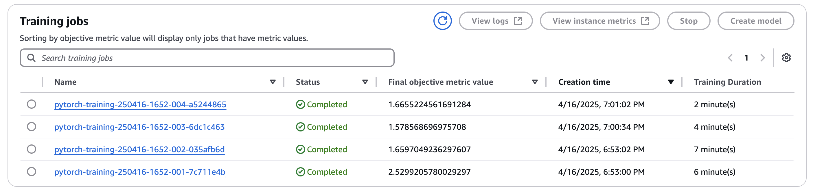
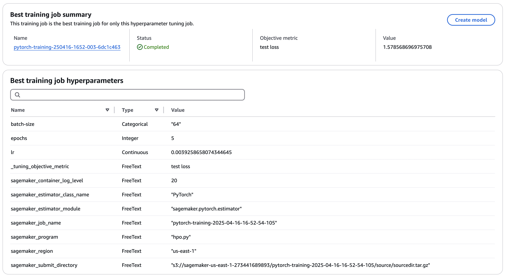
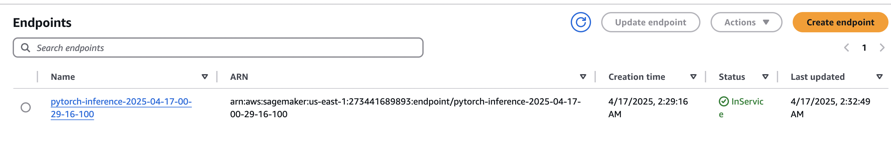

# facial-expression-classification
**Udacity AWS Machine Learning Engineer Nanodegree**

This project focuses on classifying human facial emotions using a fine-tuned **ResNet50** convolutional neural network. The goal is to achieve robust emotion recognition by experimenting with various hyperparameter ranges and leveraging AWS infrastructure for training, deployment, and inference.

The model was trained on the **FER-2013** dataset, a widely-used benchmark dataset for facial emotion recognition. All code, training jobs, and model deployments are done on AWS SageMaker, making the project **scalable**, **reproducible**, and **production-ready**.


## Project setup

Follow the instructions of the Notebook using the 'conda_pytorch_p310' kernel in an AWS Notebook instance. You will need to create an API key on Kaggle to access the FER2013 dataset.


## Explanation of files

There are 3 files in this project for model scripting:
- 'hpo.py' is used to train the first iteration of the model to search for the best hyperparameters.
- 'model_train.py' is used to train the iterated model with the best hyperparameters from the search. In this production-ready model there is a Profiler and Debugger built in to track the model.
- 'inference.py' is the script for the deployed model endpoint to start inference on an image.


## How to query the endpoint

```python
img = Image.open('test_img.jpg').convert('RGB')
img_tensor = transforms.Compose([
    transforms.Resize(256),
    transforms.CenterCrop(224),
    transforms.ToTensor(),
    transforms.Normalize(mean=[0.485, 0.456, 0.406], std=[0.229, 0.224, 0.225])
])(img).unsqueeze(0)

response = predictor.predict(image_tensor)
```

## Training, Hyperparameter Tuning Jobs and Endpoint deployment

### Training jobs completed


### Hyperparameter Tuning job completed


### Endpoint deployment

